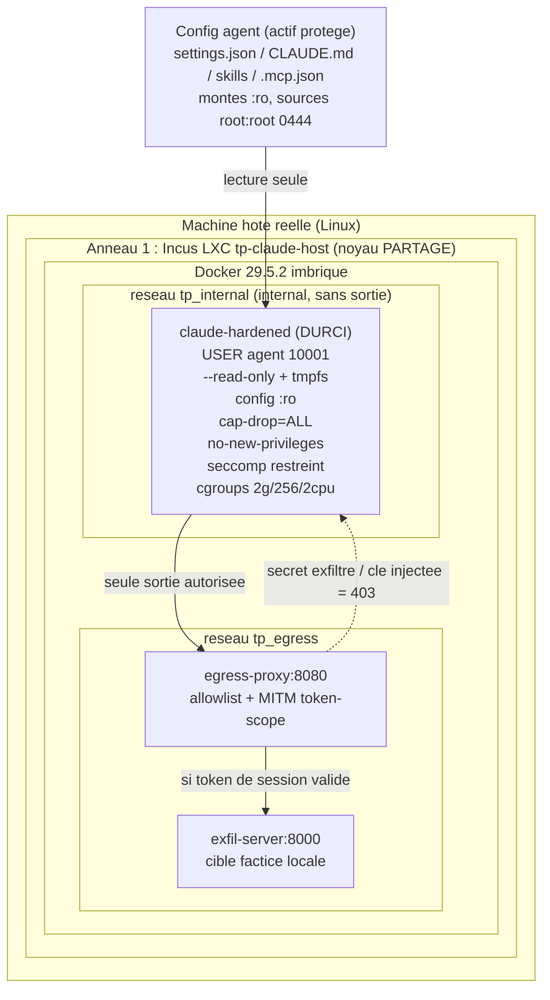

# 06 — Architecture

> Schemas de l'architecture : (1) la boucle agentique de Claude Code et sa lecture de config,
> (2) le conteneur **AVANT** (config modifiable) vs **APRES** (config `:ro`, montages, egress).

---

## 6.1 Boucle agentique + outils + lecture de config

L'agent Claude Code fonctionne en boucle : il lit sa **configuration/etat** (l'actif protege),
recoit une entree (prompt utilisateur **ou** donnee tierce), raisonne, appelle des **outils**
(lecture/ecriture fichiers, shell, reseau via MCP), observe le resultat, recommence.

```
                         +-------------------------------------------+
                         |   CONFIG / ETAT DE L'AGENT (actif protege)|
                         |   settings.json (hooks)  CLAUDE.md        |
                         |   skills (SKILL.md)      .mcp.json        |
                         +---------------------+---------------------+
                                               | lecture (et execution !)
                                               | a CHAQUE session
                                               v
   entree  -------->  +--------------------------------------------------+
   - prompt direct    |                BOUCLE AGENTIQUE                  |
   - donnee tierce    |   percevoir -> raisonner -> agir -> observer ----+
     (README, sortie  |        ^                                  |      |
      d'outil, MCP)   |        +----------------------------------+      |
   (injection         +-----------------------+--------------------------+
    indirecte !)                              | appels d'OUTILS
                                              v
                    +-----------+   +-----------+   +-----------------+
                    | FS read/  |   |  shell    |   | reseau / MCP    |
                    | write     |   | commandes |   | (egress)        |
                    +-----------+   +-----------+   +-----------------+
```

> Point cle : la config est **lue ET executee** (hooks, skills) a chaque session. Si un outil
> « FS write » peut **reecrire** cette config, l'agent peut s'auto-modifier durablement. D'ou le
> verrou `:ro`. L'entree « donnee tierce » illustre l'**injection indirecte** : un payload cache
> dans une donnee lue detourne la boucle sans que l'utilisateur l'ait demande.

---

## 6.2 Conteneur AVANT (agent NU, vulnerable)

```
+-----------------------------------------------------------------------+
| Incus LXC "tp-claude-host"  (anneau 1, noyau partage)                 |
|                                                                       |
|   Docker imbrique — reseau bridge par defaut (EGRESS LIBRE -> Internet)|
|   +---------------------------------------------------------------+   |
|   | "claude-nu" (NON DURCI)                                       |   |
|   |  USER root    PAS de --read-only    toutes capabilities       |   |
|   |  seccomp=default    PAS de limites    reseau ouvert           |   |
|   |                                                               |   |
|   |  FS : TOUT en lecture-ECRITURE (bind classique, pas de :ro)   |   |
|   |   /workspace/.claude/settings.json .. rw  <- REECRITURE OK    |   |
|   |   /workspace/CLAUDE.md .............. rw  <- POISON OK        |   |
|   |   /workspace/.mcp.json ............. rw  <- AJOUT SERVEUR OK  |   |
|   |   /workspace/.claude/skills ........ rw  <- ALTERATION OK     |   |
|   |   /run/secrets/fake_token.txt ...... present <- EXFIL OK      |   |
|   |   /  (racine) ...................... rw  <- rm destructeur OK |   |
|   +-------------------------------+-------------------------------+   |
|                                   | exfil aboutit                     |
|                                   v                                   |
|                          [ exfil-server:8000 ]  (logge le hit)        |
+-----------------------------------------------------------------------+
```

Toutes les attaques **reussissent** : la config est modifiable, le secret present, l'egress libre.

---

## 6.3 Conteneur APRES (agent DURCI)

```
+=========================================================================================+
|  MACHINE HOTE REELLE (poste etudiant) — Incus + Docker 29.5.2 (cgroup v2 + seccomp)       |
|   +-----------------------------------------------------------------------------------+  |
|   | ANNEAU 1 : Incus LXC "tp-claude-host" (images:debian/12, security.nesting=true)   |  |
|   |            >> NOYAU PARTAGE avec l'hote (leger, moins sur ; VM = ideal documente) |  |
|   |                                                                                   |  |
|   |   reseau tp_internal (internal=true, AUCUNE route sortie)                         |  |
|   |   +---------------------------------------------+      reseau tp_egress           |  |
|   |   | ANNEAU 2 : "claude-hardened" (DURCI)        |      +------------------------+  |  |
|   |   |  USER agent(10001)  --read-only  cap-drop ALL|----->| "egress-proxy" :8080   |  |  |
|   |   |  no-new-privileges  seccomp=seccomp-claude  | tp_  | allowlist + MITM token |  |  |
|   |   |  --memory 2g --pids-limit 256 --cpus 2      | egr  +-----------+------------+  |  |
|   |   |                                             | ess              | allow only   |  |  |
|   |   |  FS : racine ro + tmpfs ; config montee :ro |                  v              |  |  |
|   |   |   /workspace .................... rw         |      +------------------------+  |  |
|   |   |   /workspace/.claude/settings.json .. ro    |      | "exfil-server" :8000   |  |  |
|   |   |   /workspace/CLAUDE.md .............. ro     |<--X--| (cible factice locale) |  |  |
|   |   |   /workspace/.mcp.json ............. ro      |  bloque tant que pas de token |  |  |
|   |   |   /workspace/.claude/skills ........ ro      |      +------------------------+  |  |
|   |   |   /home/agent/.claude/settings.json  ro     |                                  |  |
|   |   |   /home/agent/.claude/skills ....... ro     |   secret factice : NON monte     |  |
|   |   |   /home/agent/.claude (reste) ...... tmpfs  |   (jamais dans l'image)          |  |
|   |   |   /tmp /run ........................ tmpfs  |                                  |  |
|   |   +---------------------------------------------+                                  |  |
|   +-----------------------------------------------------------------------------------+  |
+=========================================================================================+
```

Toutes les attaques sont **bloquees** : config `:ro`, racine read-only, secret absent, egress
canalise par un proxy qui valide le **token de session** (MITM defensif).

---

## 6.4 Vue logique (Mermaid)



---

## 6.5 Cartographie fichiers <-> mecanismes

| Fichier / artefact | Groupe | Role architectural |
|---|---|---|
| `agent/Dockerfile` | agent | Image `claude-hardened` (USER agent 10001, non-root) |
| `agent/seccomp-claude.json` | agent | Profil seccomp restreint (allowlist syscalls) |
| `proxy/` | proxy | `egress-proxy` : allowlist + MITM token-scope |
| `exfil/` | exfil | `exfil-server` : cible factice locale :8000 |
| `config/` | config | Config figee `root:root 0444` (settings/CLAUDE.md/mcp/skills) |
| `workspace/` | (commun) | Depot de test monte `:rw` |
| `scripts/00..09` | scripts | Orchestration (build, reseaux, run, attaques, rapport) |
| `run.sh` | scripts | Master fail-fast (`up` / `attack` / `report` / `clean`) |
| `docs/` | **docs** | Cette documentation (livrable PDF) |
